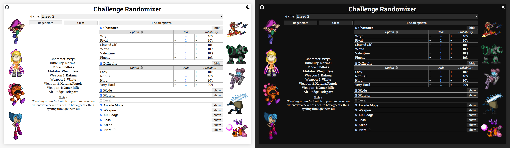

A simple web page that takes a collection of categories for a video game (what playable character on what difficulty setting to use, which weapons to select, etc) and randomly chooses 1 or more options for each, making a decision for you if you're bored of perhaps even giving you an idea with some unexpected combination.

The probability of selecting any specific option can be adjusted, including setting it to 0% (never select) or 100% (always select), meaning you can use it with specific subsets only if desired (e.g. always choose this character and never choose this weapon, but randomize the rest). There's also a fully editable "Extra" category where you can put any bonus conditions (e.g. finish without jumping, go as fast as you can).

Made for [Bleed Discord Community](https://discord.com/invite/EzxrRew), as well as a front-end exercise in vanilla JS and responsive web design.

Inspired by [The Pyramid: Ultimate](https://olexa.itch.io/pyramid-ultimate) and started with [Bleed 2](https://store.steampowered.com/app/396350/Bleed_2/) in mind but built in an abstract way, with all game-specific info coming from a JSON object in `data.js`, and thus can be easily adapted to include any other game where it makes sense to randomize a run based on some "X out of N" selections.

## Usage
### Web version
https://nsndp.github.io/challenge-randomizer

A more convenient option for general use. Any edits to odds/probabilities or extras are saved automatically in the browser's local storage, so you don't have to customize from scratch every session (unless an update was pushed, but that should be a very rare occurence).

### Local version
Download all files, open `main.html` in a browser directly from the disk, then edit DATA object in `data.js` and just refresh the page. Choose this option if you want to edit categories/options themselves or add new games. Customization through the browser page will still get saved in the storage, but any changes to DATA will take precedence and overwrite it.